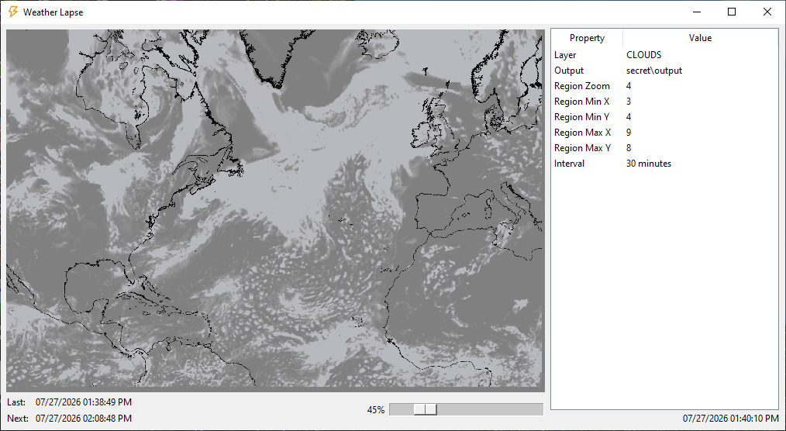
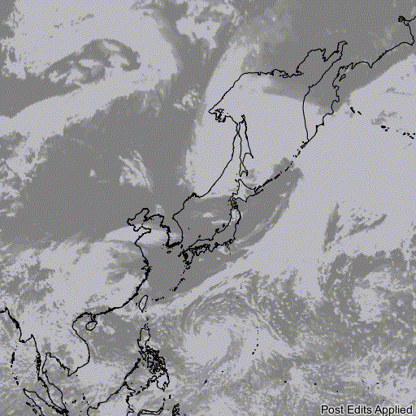
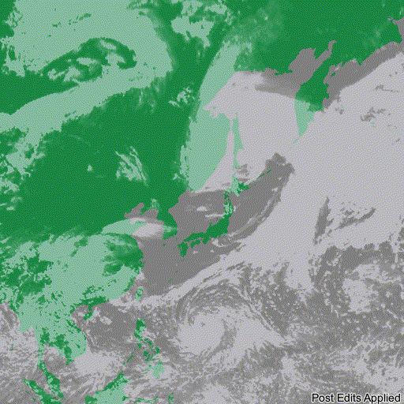

# Weather Lapse

Weather Lapse is an open-source program designed to create real-time renderings of the atmospheric conditions within a region. It was written in Python and takes advantage of multiprocessing to prevent bottlenecking the program during rendering, as well as tkinter for the GUI and requests for pulling real-time data. It uses OpenWeather to acquire its atmospheric data and OpenStreetMap to acquire its geographic data.

One use for this program is creating an hour-by-hour rendering of a tropical system (such as a hurricane) as it forms, intensifies, weakens, and ultimately dissipates.

## Gallery

These are time-lapses of Tropical Storm Jangmi (bottom-half) as it approaches Japan during the 2026 Pacific typhoon season. These time lapses were created from exported renderings from Weather Lapse.